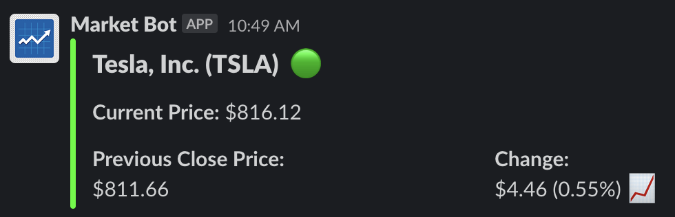
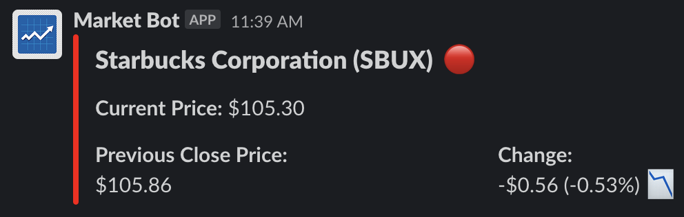

# MarketBot
Simplest stock market script & bot for Slack

## Instalation

To install dependencies needed run:

```
$ pip install -r requirements.txt
```

## Script usage

```
$ python3 stock.py -h
usage: stock.py [-h] -s SYMBOL

Script that queries Yahoo Finance to retrieve a symbol's price

optional arguments:
  -h, --help            show this help message and exit
  -s SYMBOL, --symbol SYMBOL
                        Symbol you want to query
```

Example
```
$ python3 stock.py -s TSLA
Tesla, Inc. (TSLA)
Price: 816.12
Previous: 811.66 - Change: 4.46 (0.55%)
```

## Bot usage

Steps on how to create your Slack App can be found [here](https://github.com/slackapi/python-slack-sdk/blob/main/tutorial/01-creating-the-slack-app.md)

After it's all set up you can add the bot to a channel in your slack workspace.

To use it just type any symbol prefixed by the `$` sign and the bot will reply with the stock information. (i.e `$TSLA`, `$SBUX`)

Like this:




### Hosting bot locally

Export the token and signing keys as environment variables:

```
export SLACK_BOT_TOKEN='YOUR_BOT_TOKEN_HERE'
export SLACK_SIGNING_SECRET='YOUR_SIGNING_KEY_HERE'

```
Configure `ngrok` (you could use other service if you prefer) to create a public URL that tunnels the requests to your machine. Steps to configure `ngrok` can be found [here](https://dashboard.ngrok.com/get-started/setup)

Make sure you run `ngrok` specifying the same port as defined in `bot.py`

Run the bot:

```
$ python3 bot.py 
 * Serving Flask app "bot" (lazy loading)
 * Environment: production
   WARNING: This is a development server. Do not use it in a production deployment.
   Use a production WSGI server instead.
 * Debug mode: off
 * Running on http://0.0.0.0:5000/ (Press CTRL+C to quit)
```

After it's all up and running you need to go to Slack Apps -> Features -> Event Subscriptions and enable events as well as adding the ngrok url and include `message.channels` in the list `Subscribe to bot events`

### Hosting bot in Heroku

If you don't want to host the bot locally you can use the free tier of Heroku to host it. This repo includes the `requirements.txt` and `Procfile` needed for Heroku to identify this project as Python app and run it after building it.

More details on how to setup Heroku, push the code, etc can be found [here](https://devcenter.heroku.com/articles/getting-started-with-python)

Don't forget to configure the environment variables:

If you have heroku cli, configure environment variables like this:
```
heroku config:set SLACK_BOT_TOKEN="YOUR_BOT_TOKEN_HERE"
heroku config:set SLACK_SIGNING_SECRET="YOUR_SIGNING_KEY_HERE"
```

If you don't want to use the `cli` they can be configured on the app Dashboard -> Settings -> Config Vars

After it's all up and running you need to go to Slack Apps -> Features -> Event Subscriptions and enable events as well as adding the heroku url and include `message.channels` in the list `Subscribe to bot events`
